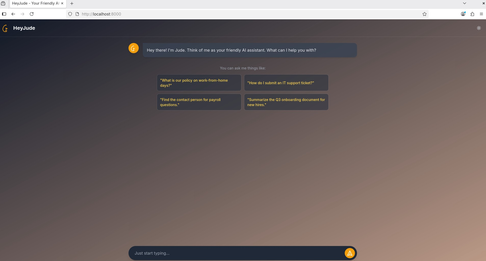
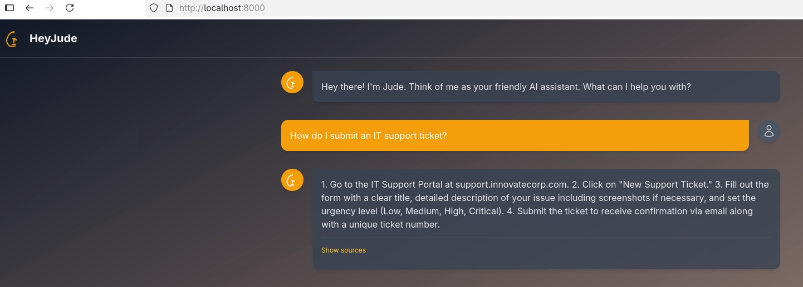

# HeyJude - AI Assistant for Internal Documents

HeyJude is a smart, friendly AI assistant designed to help employees navigate internal company documents and processes. It uses a Retrieval-Augmented Generation (RAG) architecture to provide accurate, context-aware answers based on a specific knowledge base (in this case, an employee handbook PDF).

## Features

* **Interactive Chat Interface:** A modern, user-friendly frontend for seamless interaction.
* **Document-Aware Responses:** Answers are generated based on the content of provided internal documents, ensuring accuracy.
* **Source Highlighting:** Users can see the exact text from the source document that was used to generate an answer, providing transparency and trust.
* **Dark/Light Mode:** A theme toggle for user comfort.
* **RAG Architecture:** A robust backend that can be easily extended with more documents.

## Screenshots

Here is a look at the HeyJude interface in action.

**Main Chat Interface:**
`[YET TO INSERT SCREENSHOT OF THE MAIN CHAT WINDOW HERE]`

**"Show Sources" Feature:**
`[YET TO INSERT SCREENSHOT OF AN AI RESPONSE WITH THE SOURCES EXPANDED HERE]`

## Tech Stack

* **Backend:**
    * **Python 3.10+**
    * **FastAPI:** For creating the web server and API endpoints.
    * **Uvicorn:** As the ASGI server to run the application.
    * **LangChain:** To orchestrate the RAG pipeline (document loading, splitting, and the QA chain).
    * **Ollama (phi3:mini):** For the Large Language Model (LLM) that generates answers.
    * **ChromaDB:** As the vector database to store and retrieve document embeddings.
    * **SentenceTransformers:** For creating the text embeddings.
* **Frontend:**
    * **HTML5**
    * **Tailwind CSS:** For all styling.
    * **Vanilla JavaScript:** For interactivity and API communication.

## Setup and Installation

Follow these steps to set up and run the project locally.

### 1. Prerequisites

* Python 3.10 or newer.
* [Ollama](https://ollama.com/) installed and running with the `phi3:mini` model pulled.
    ```bash
    ollama pull phi3:mini
    ```

### 2. Clone the Repository

First, clone the project repository to your local machine.
```bash
git clone <your-repository-url>
cd Hey-Jude
```

### 3. Set Up a Virtual Environment

It is highly recommended to use a virtual environment to manage project dependencies.

```bash
# Create the virtual environment
python3 -m venv venv

# Activate it
source venv/bin/activate
```

### 4. Install Dependencies

Install all the required Python packages using the `requirements.txt` file.

```bash
pip install -r app/requirements.txt
```

### 5. Add Your Document

Place the PDF document you want the AI to learn from into the `app/data/` directory. For this project, it should be named `handbook.pdf`.

## Execution

The application runs in two stages: a one-time data ingestion and the main server application.

### 1. Ingest Your Data

This step reads your PDF, creates embeddings, and stores them in the local ChromaDB database. **You only need to run this once**, or whenever you update your source document.

```bash
python app/ingest.py
```

After running, you should see a new `db` folder inside the `app` directory.

**Ingestion Log:**
`[YET TO ADD A SCREENSHOT OF THE INGESTION SCRIPT'S TERMINAL OUTPUT HERE]`

### 2. Run the Application

Start the FastAPI server using Uvicorn.

```bash
uvicorn app.main:app --reload
```



The server will be running on `http://localhost:8000`. Open this URL in your web browser to start chatting with HeyJude.



## Project Structure

The project is organized as follows:

```
Hey-Jude/
├── app/
│   ├── data/
│   │   └── handbook.pdf      # Source document for the AI
│   ├── db/
│   │   └── ...               # ChromaDB vector store (created by ingest.py)
│   ├── frontend/
│   │   ├── static/           # For future CSS/JS files
│   │   └── index.html        # The main chat interface
│   ├── ingest.py             # Script to process and store document knowledge
│   └── main.py               # The FastAPI backend server
└── requirements.txt          # Project dependencies
```