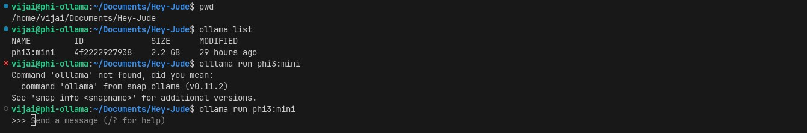
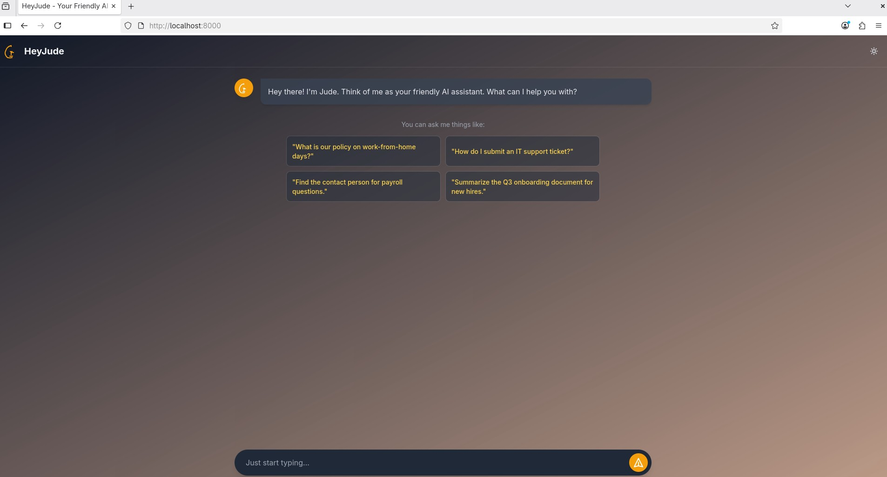

## HeyJude - AI Assistant (Two-Service Architecture)

HeyJude is a smart, friendly AI assistant designed to help employees navigate internal company documents. This project is built using a modern, scalable two-service architecture.

## Architecture Overview

The application is split into two distinct services for better performance, security, and separation of concerns:

1.  **RAG/Inference Service:** A dedicated backend that lives on the same server as the Ollama model. It handles all data ingestion, vector storage, and AI processing.
2.  **Frontend Service:** A lightweight, containerized service that serves the user interface and acts as a proxy, forwarding user requests to the RAG service.

```
[User's Browser] <--> [Frontend Service (Docker)] <--> [RAG/Inference Service (Ollama Server)]
```

---

## Features

* **Interactive Chat Interface:** A modern, user-friendly frontend for seamless interaction.
* **Document-Aware Responses:** Answers are generated based on the content of provided internal documents.
* **Source Highlighting:** Users can see the exact text from the source document that was used to generate an answer.
* **Dark/Light Mode:** A theme toggle for user comfort.
* **Scalable Two-Service Design:** Decouples the UI from the AI, allowing them to be scaled and managed independently.

---



## Screenshots

**Main Chat Interface:**




**"Show Sources" Feature:**


---

## Tech Stack

### RAG/Inference Service (Backend)
* **Python 3.10+**
* **FastAPI & Uvicorn**
* **LangChain, ChromaDB, SentenceTransformers, PyPDF**
* **Ollama (phi3:mini)**

### Frontend Service (UI & Proxy)
* **Python 3.10+**
* **FastAPI & Uvicorn**
* **HTTPX:** For making API calls to the RAG service.
* **Docker:** For containerization.
* **HTML, Tailwind CSS, Vanilla JavaScript**

---

## Setup and Execution

Follow these steps to set up and run both services.

### Part 1: RAG/Inference Service (On the Ollama Server)

This service must be running before you start the frontend.

#### **Folder Structure (`rag-service/`)**
```
rag-service/
├── app/
│   ├── data/
│   │   └── handbook-v1.pdf
│   ├── db/
│   │   └── ...
│   ├── ingest.py
│   └── rag_main.py
├── .env
└── requirements.txt
```

#### **Setup & Run**
1.  **Install Dependencies:**
    ```bash
    pip install -r requirements.txt
    ```
2.  **Configure Environment:** Create a `.env` file with the local Ollama URL:
    ```
    OLLAMA_BASE_URL=http://localhost:11434
    ```
3.  **Ingest Data:** Run the ingestion script to build the vector database.
    ```bash
    python app/ingest.py
    ```
4.  **Start the Service:** Run the Uvicorn server. It must listen on `0.0.0.0` to be accessible on the network.
    ```bash
    uvicorn app.rag_main:app --host 0.0.0.0 --port 8001 --reload
    ```

### Part 2: Frontend Service:

This service serves the UI to the user.

#### **Folder Structure (`frontend-service/`)**
```
frontend-service/
├── app/
│   ├── frontend/
│   │   └── index.html
│   └── main.py
├── .env
├── Dockerfile
└── requirements.txt
```

#### **Setup & Run**
1.  **Install Dependencies:**
    ```bash
    pip install -r requirements.txt
    ```
2.  **Configure Environment:** Create a `.env` file with the IP address and port of your RAG service:
    ```
    RAG_SERVICE_URL=[http://192.168.2.210:8001](http://192.168.2.210:8001)
    ```
3.  **Build the Docker Image:**
    ```bash
    docker build -t heyjude-frontend:1.0 .
    ```
4.  **Run the Docker Container:** Use the `--env-file` flag to pass the configuration.
    ```bash
    docker run --env-file ./.env -p 8000:8000 --name heyjude-frontend heyjude-frontend:1.0
    ```
5.  **Access the Application:** Open your browser and navigate to `http://localhost:8000`.


#### Part3: Jenkins CI Implementation

# Jenkins CI/CD Process Overview

This document provides a brief summary of the custom Jenkins agent and the pipeline (`Jenkinsfile`) used for the HeyJude project.

---

## 1. Custom Jenkins Agent

To ensure a consistent and clean build environment, the pipeline runs on a custom Docker-based Jenkins agent. This approach avoids installing tools directly on the Jenkins master and makes the build process portable.

### Agent Creation Process

1.  **Define the Environment (`Dockerfile`):** A dedicated `Dockerfile` (located in the `jenkins-agent/` directory) is used to define the agent's environment. It starts from a base Jenkins agent image and installs all necessary build and security tools:
    * Docker CLI
    * Python & Pip
    * Bandit (SAST)
    * Trivy (Container Scanner)
    * OWASP Dependency-Check CLI
    * SonarQube Scanner

2.  **Build the Image:** The `Dockerfile` is used to build a Docker image.
    ```bash
    docker build -t your-dockerhub-username/heyjude-jenkins-agent:1.0 .
    ```
```
...
  inflating: /opt/dependency-check/lib/toml4j-0.7.2.jar  
  inflating: /opt/dependency-check/lib/velocity-engine-core-2.3.jar  
  inflating: /opt/dependency-check/lib/xz-1.9.jar  
  inflating: /opt/dependency-check/LICENSE.txt  
  inflating: /opt/dependency-check/NOTICE.txt  
  inflating: /opt/dependency-check/licenses/commons-cli/LICENSE.txt  
  inflating: /opt/dependency-check/README.md  
 ---> Removed intermediate container 5c5aba7eae5b
 ---> 3377380d7b7a
Step 10/10 : USER jenkins
 ---> Running in ebf10feda217
 ---> Removed intermediate container ebf10feda217
 ---> 57b3f04879c0
Successfully built 57b3f04879c0
Successfully tagged vijai-veerapandian/hey-jude-jenkins-agent:1.0
➜  jenkins-agent git:(feature1) ✗ docker images
REPOSITORY                       TAG            IMAGE ID       CREATED          SIZE
vijai-v/hey-jude-jenkins-agent   1.0            57b3f04879c0   10 seconds ago   1.35GB
```

3.  **Push to a Registry:** The built image is pushed to a container registry (like Docker Hub) so the Jenkins master can pull it when a pipeline job starts.
    ```bash
    docker push your-dockerhub-username/heyjude-jenkins-agent:1.0
    ```

4. **Pushing the image into docker hub. 

```
  Hey-Jude git:(feature1) docker push vijaiv/hey-jude-jenkins-agent:1.0 
The push refers to repository [docker.io/vijaiv/hey-jude-jenkins-agent]
05d13ece579f: Pushed 
a467dfbb0249: Pushing [==================================================>]  128.3MB
0d3af3d749cc: Pushing [===============================================>   ]  146.5MB/155MB
233da6cdb645: Pushing [==============>                                    ]  91.11MB/305.4MB
99d8e47cdc53: Pushing [=============>                                     ]  105.7MB/382.6MB
5f70bf18a086: Pushed 
97ab68c8e1f6: Pushed 
67cad0c9b7f5: Pushing [===============>                                   ]  26.99MB/89.
```

---

## 2. Jenkinsfile Pipeline

The `Jenkinsfile` is the core of the CI/CD process. It defines all the stages the code goes through from checkout to deployment.

### Pipeline Flow

1.  **Agent Declaration:** The pipeline begins by declaring that all subsequent stages will run inside the custom `hey-jude-jenkins-agent` container we created.

2.  **Checkout:** It checks out the latest source code from the Git repository.

3.  **Security Scans:** A series of security checks are performed in parallel:
    * **OWASP Dependency-Check:** Scans project dependencies for known vulnerabilities.
    * **Bandit (SAST):** Analyzes the Python code for common security issues.
    * **SonarQube Analysis:** Performs a deep code quality and security scan.

4.  **Docker Build:** It builds the `heyjude-frontend` application Docker image using its `Dockerfile`.

5.  **Trivy Scan:** The newly built Docker image is scanned for operating system and package vulnerabilities.

6.  **Push to Docker Hub:** If all previous stages pass, the application image is tagged and pushed to Docker Hub.

7.  **Notifications:** Throughout the process, notifications are sent to a Slack channel to report the status of each stage. Final success or failure notifications are sent at the end.

8.  **Artifacts:** All generated security reports (HTML files) are archived as build artifacts, which can be downloaded and reviewed from the Jenkins job page.

## 3. Configure Your Jenkins Master

Now, you need to set up Jenkins to support the pipeline:

### Install Plugins
In **Manage Jenkins** → **Plugins**, make sure you have installed:
- Docker Pipeline
- Slack Notification
- OWASP Dependency-Check
- SonarQube Scanner

### Add Credentials
In **Manage Jenkins** → **Credentials**, add the credentials your Jenkinsfile needs:
- Your Docker Hub username and password (**ID:** `dockerhub-credentials`)
- Your Slack webhook token (**ID:** `slack-webhook-credentials`)
- Your SonarQube authentication token (**ID:** `sonarqube-credentials`)

### Configure Tools
In **Manage Jenkins** → **Global Tool Configuration**, add an installation for the **SonarQube Scanner**.

### Configure SonarQube Server
In **Manage Jenkins** → **Configure System**, add your SonarQube server details.

---

## 4. Create the Jenkins Pipeline Job

The final step is to create the pipeline job in Jenkins:

1. In Jenkins, click **New Item**.
2. Enter a name `Hey-Jude-Pipeline` and select **Pipeline**.
3. In the configuration, go to the **Pipeline** section.
4. Change the **Definition** to **Pipeline script from SCM**.
5. Select **Git** and enter your repository URL.
6. Ensure the **Script Path** is set to `Jenkinsfile`.
7. Click **Save**.
8. You can now click **Build Now** to run your complete CI/CD pipeline.

